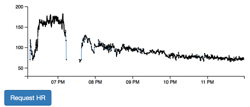
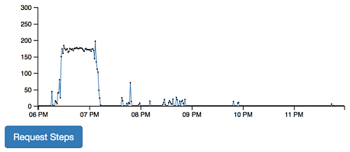
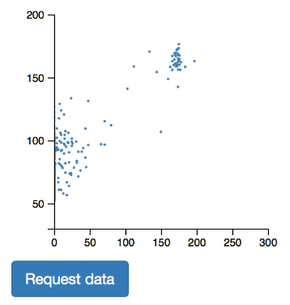
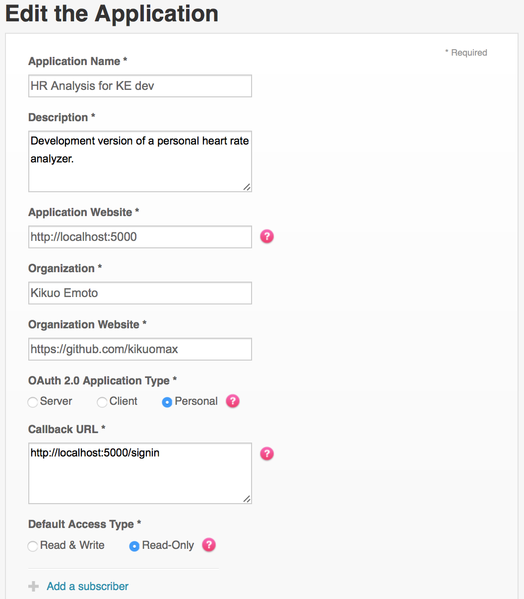
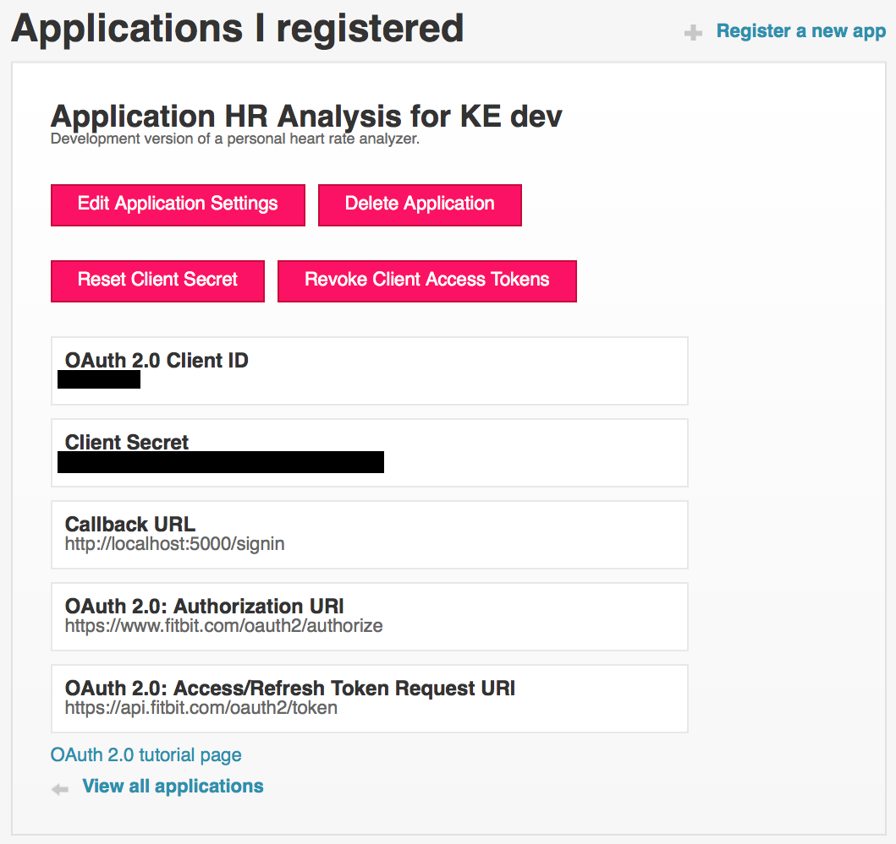

# HR Analysis

**HR Analysis** is a web application for [Fitbit](https://www.fitbit.com/home), which obtains heart rates (HR) and activities through the Fitbit Web API and plots them.
This could be a good example of how to handle the Fitbit Web API with JavaScript.

To try this application, you need to register this as your **personal** application unless you are specially granted by Fitbit to access heart rates and intraday activity records of other users.

You have to read the [Fitbit Term of Service](https://dev.fitbit.com/legal/terms-of-service/) before deploying your Fitbit application.

## Features

This application currently has the following features,

 - [HR time series plot](#hr-time-series-plot)
 - [Step count time series plot](#step-count-time-series-plot)
 - [Step count &times; HR scatter plot](#step-count--hr-scatter-plot)

### HR time series plot

Here is an example of an HR time series plot.
The x-axis and y-axis represent time and HR respectively.



### Step count time series plot

Here is an example of a step count time series plot.
The x-axis and y-axis represent time and step count respectively.



### Step count &times; HR scatter plot

Here is an example of a scatter plot between step count and HR.
The x-axis and y-axis represent step count and HR respectively.



## Running HR Analysis locally

You can register a web application running on your local machine; i.e., `localhost`.

### Prerequisites

You need the following software installed,

 - [Node.js](https://nodejs.org/en/) (tested with `v8.9.3`)

### Registering your application for localhost

You can jump to the application registration page from the [Fitbit developer site](https://dev.fitbit.com) &rarr; **Tools** &rarr; **Register a Web App**.

Here is an example configuration for a service running on `localhost`.



The key is that you set the application type to `Personal` and the callback URL to `http://localhost:<port>/signin` with `<port>` of your preference (5000 by default).

After your application is successfully installed, you will see a screen similar to the following,



You need **OAuth 2.0 Client ID** and **Client Secret** to configure your web application.
You can check the application information later from the [Fitbit developer site](https://dev.fitbit.com) &rarr; **Tools** &rarr; **Manage My Web Apps**.

### Running the web application on localhost

Please take the following steps to run the application locally,

 1. Suppose you are at the project's root directory.

 2. Install necessary modules.

	```
	npm install
	```

 3. Configure the following environment variables,

     - `COOKIE_PASSWORD`

	   Password to encrypt the cookie.

     - `FITBIT_OAUTH2_CLIENT_ID`

	   **OAuth 2.0 Client ID** of your Fitbit application.

	 - `FITBIT_OAUTH2_CLIENT_SECRET`

	   **Client Secret** of your Fitbit application.

	 - `PORT`

	   Optional port number on which your application is to run.
	   `5000` is used if omitted.

 4. Run `service.js` on Node.js.

    ```
	node service.js
	```

 5. Open http://localhost:5000/ with your browser.

 6. You will be able to see your HR and step count data after signing in with your Fitbit account.

## Libraries

This application directly depends on the following libraries,

 - [hapi](https://hapijs.com)
 - [bell](https://github.com/hapijs/bell)
 - [wreck](https://github.com/hapijs/wreck)
 - [hapi-auth-cookie](https://github.com/hapijs/hapi-auth-cookie)
 - [inert](https://github.com/hapijs/inert)
 - [good](https://github.com/hapijs/good)
 - [boom](https://github.com/hapijs/boom)
 - [Vue.js](https://vuejs.org)
 - [D3.js](https://d3js.org)
 - [jQuery](https://jquery.com)
 - [URI.js](https://medialize.github.io/URI.js/)

## Reference

 - [Fitbit](https://www.fitbit.com/home)
 - [Fitbit developer](https://dev.fitbit.com)
 - [Fitbit Term of Service](https://dev.fitbit.com/legal/terms-of-service/)

